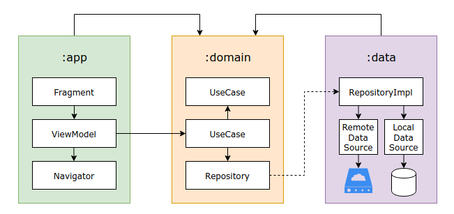

# Rick & Morty App

---

## Introduction

Android application using all that I know at the moment and [Rick & Morty API](https://rickandmortyapi.com/).

---

## Setup Instructions

Just clone the project wherever you want and open it with Android Studio, no further setup needed :)

The sync can take a little long because of the number of dependencies inside the project.

---

## Architecture Explanation

I choose to modularize just the project layers instead of the features because there were just two screens and there are no plans to add more. I focused on ease to maintain and on Clean Architecture principles.

    
    
<i>This is a representation of the architecture, the connection between UseCases is not obligatory, more details below.</i>

    
<i>The arrows on the top can be read as "talks to".</i>

### :app

This is the presentation layer, it is responsible for what the user sees.

- **Fragment**: The Fragment is responsible to listen to the user inputs and its ViewModel outputs, almost all of them are state machines.
- **ViewModel**: It expects the Fragment inputs and calls the UseCases, from _domain_ module, then, it can output the data to the Fragments via LiveData observers. All the ViewModels in this project also have a Navigator.
- **Navigator**: It navigates or pops to other fragments.

### :domain

This is the domain layer, it holds the business rules of the applications and it is a pure Kotlin module.

- **UseCase**: It is responsible for the business rules on the application, it talks to the repositories by dependency inversion or to another use cases.

### :data

This is the data layer, it does not contain any business rules, it is responsible to get data from local or remote data sources.

- **Repository**: It is just a composition of local or remote data sources, the interfaces on those are from the _domain_ module.
- **DataSource**: It is responsible to talk with the remote server or local database.

---

## Continuous Integration

The project uses Github Actions to run the [CI scripts](./.github/workflows) when a Pull Request is opened or a Tag is created.

### On Pull Request

- **Static code analysis**: The script uses the _detekt_ gradle plugin to check if all the code is formatted consistently and there are not **any** issues with complexity.
- **Code coverage**: _JUnit5_ is responsible for running the unit tests, _Jacoco_ is responsible for generating the test report and then Codecov.io checks if the coverage is the expected.

    

